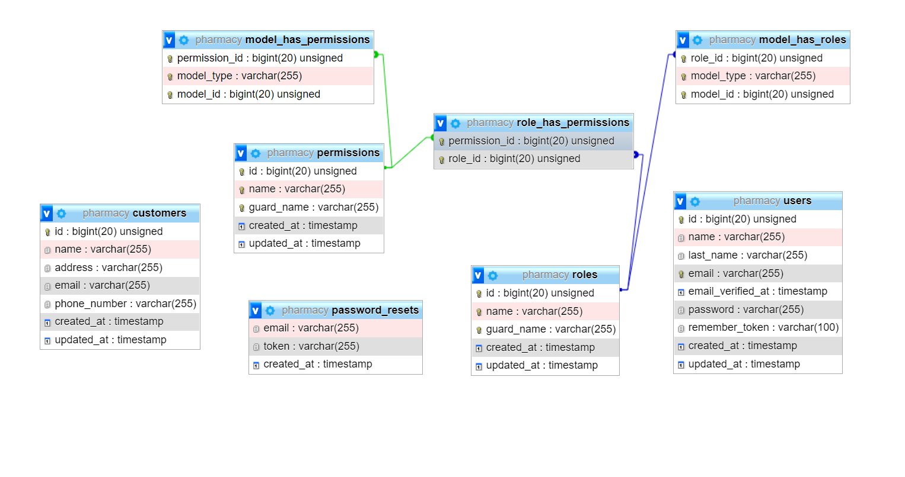

Step 1 - Setting up your development environment on your local machine :

$ git clone https://bitbucket.org/DulanN/school_billing

* Settup the environment file according to your server and then, 

$ composer update

$ php artisan key:generate

$ php artisan migrate:fresh --seed

$ php artisan serve

Step 2 - User Accounts 

* owner
  

    owner@owner.com 
    password - password

* cashier
  

    cashier@cashier.com
    password - password

* manager 
  

    manager@manager.com
    password - password

EER diagram:

